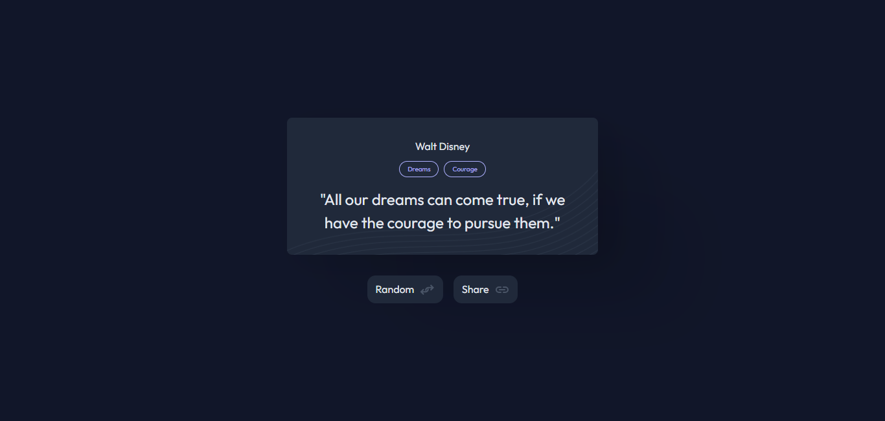

<!-- Please update value in the {}  -->

<h1 align="center">Random Quote Generator | devChallenges</h1>

<div align="center">
   Solution for a challenge <a href="https://devchallenges.io/challenge/random-quote" target="_blank">Random Quote
</a> from <a href="http://devchallenges.io" target="_blank">devChallenges.io</a>.
</div>

<div align="center">
  <h3>
    <a href="https://gustavo2023.github.io/random-quote-generator/">
      Demo
    </a>
    <span> | </span>
    <a href="https://devchallenges.io/solution/46884">
      Solution
    </a>
    <span> | </span>
    <a href="https://devchallenges.io/challenge/random-quote">
      Challenge
    </a>
  </h3>
</div>

<!-- TABLE OF CONTENTS -->

## Table of Contents

- [Overview](#overview)
  - [What I learned](#what-i-learned)
- [Built with](#built-with)
- [Features](#features)

<!-- OVERVIEW -->

## Overview



This **Random Quote Generator** shows a random quote along with its author and category tags for the quote. The user is able to see a new random quote by clicking the random button. The user is also able to copy the quote to the clipboard by clicking the share button.

### What I learned

- **Working with APIs:** learned how to fetch data from an external API using the ```fetch``` function.
- **Asynchronous Programming:** gained experience working with Promises and chaining ```.then()``` and ```.catch()``` for handling asynchronous operations. Also, learned how to handle errors gracefully in asynchronous code.
- **Clipboard:** learned how to use the ```navigator.clipboard.writeText()``` method to copy text to the clipboard.
- **Error Handling:** implemented error handling for failed API requests and clipboard operations to ensure a smooth user experience.

### Built with

- Semantic HTML5 markup
- CSS custom properties
- Flexbox
- JavaScript

## Features

- **Random Quote Display:** displays a random quote along its author and associated tags. Quotes are fetched dynamically from an external API.
- **Random Button:** allows users to generate a new random quote by clicking the "Random" button.
- **Copy to Clipboard:** users can copy the displayed quote to their clipboard by clicking the "Share" button.
- **Dynamic Tags:** tags associated with each quote are displayed dynamically and styles appropriately.
- **Error Handling:** displays a user-friendly error message if the quote fails to load due to network or API issues.

This application/site was created as a submission to a [DevChallenges](https://devchallenges.io/challenges-dashboard) challenge.

## Author

- GitHub [@gustavo2023](https://github.com/gustavo2023)
